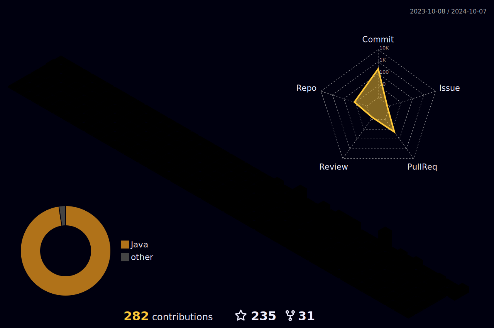

<div align="center">

  <!-- knock code pictures 程序媛敲代码的图片 -->
  <picture>
    <source media="(prefers-color-scheme: dark)" srcset="./assets/images/818000.svg" />
    <source media="(prefers-color-scheme: light)" srcset="./assets/images/818000.svg" />
    
  </picture>

   
   
   
   
   
   
   
   
   
   
   
   
   

   
   
   
   
   
   
   
   
   
   
   

   
   
   
   
   
   
   
   
   
   
   
   

  <!-- Snake Code Contribution Map 贪吃蛇代码贡献图 -->
  <picture>
    <source media="(prefers-color-scheme: dark)" srcset="./assets/grid-snake/grid-snake-dark.svg" />
    <source media="(prefers-color-scheme: light)" srcset="./assets/grid-snake/grid-snake.svg" />
    
  </picture>
</div>

# 🙋 Hello

### 🤺 About Me

<p>&emsp;&emsp;Hi, I'm Kimi. Passionate about programming, photography, reading, and traveling.</p>
<p>&emsp;&emsp;I love computer science and the internet industry, aspiring to become an excellent developer.</p>
<p>&emsp;&emsp;We're making the world a better place, through constructing elegant hierarchies for maximum code reuse and extensibility.</p>
<p>&emsp;&emsp;<strong>We're making the world a better place. Through constructing elegant hierarchies for maximum code reuse and extensibility.</strong></p>

<!-- ########################################## 分割 ########################################## -->


<div align="left">

<!--START_SECTION:waka-->
**I'm an Early 🐤** 

```text
🌞 Morning                64 commits          ██████░░░░░░░░░░░░░░░░░░░   25.40 % 
🌆 Daytime                126 commits         ████████████░░░░░░░░░░░░░   50.00 % 
🌃 Evening                54 commits          █████░░░░░░░░░░░░░░░░░░░░   21.43 % 
🌙 Night                  8 commits           █░░░░░░░░░░░░░░░░░░░░░░░░   03.17 % 
```
📅 **I'm Most Productive on Thursday** 

```text
Monday                   51 commits          █████░░░░░░░░░░░░░░░░░░░░   20.24 % 
Tuesday                  38 commits          ████░░░░░░░░░░░░░░░░░░░░░   15.08 % 
Wednesday                29 commits          ███░░░░░░░░░░░░░░░░░░░░░░   11.51 % 
Thursday                 52 commits          █████░░░░░░░░░░░░░░░░░░░░   20.63 % 
Friday                   17 commits          ██░░░░░░░░░░░░░░░░░░░░░░░   06.75 % 
Saturday                 33 commits          ███░░░░░░░░░░░░░░░░░░░░░░   13.10 % 
Sunday                   32 commits          ███░░░░░░░░░░░░░░░░░░░░░░   12.70 % 
```


📊 **This Week I Spent My Time On** 

```text
🕑︎ Time Zone: Asia/Shanghai

💬 Programming Languages: 
No Activity Tracked This Week

🔥 Editors: 
No Activity Tracked This Week

💻 Operating System: 
No Activity Tracked This Week
```


 Last Updated on 11/01/2026 23:55:31 UTC
<!--END_SECTION:waka-->

</div>

<!-- ########################################## 分割 ########################################## -->


<div align="center">

<!-- metrics 基础资料 -->
<!-- GitHub Activity Graph GitHub 活动图 -->
<table>
  <tr>
    <td>
      <picture>
        <source media="(prefers-color-scheme: dark)" srcset="https://github-readme-activity-graph.vercel.app/graph?username=818000&theme=xcode&bg_color=FF000000&hide_border=true" />
        <source media="(prefers-color-scheme: light)" srcset="https://github-readme-activity-graph.vercel.app/graph?username=818000&theme=xcode&bg_color=FF000000&color=000000&hide_border=true" />
        
      </picture>
  </tr>
</table>

</div>

<!-- ########################################## 分割 ########################################## -->


<div align="center" >

<!-- GitHub 奖杯🏆 -->
<div><br/></div>

<!-- Wakatime Graph-->
<table>
  <tr>
    <td></td>
    <td></td>
  </tr>
</table>

</div>

<!-- ########################################## 分割 ########################################## -->


<div align="center" >

<!-- profile-3d-contrib 3D 贡献图-->
<picture>
  <source media="(prefers-color-scheme: dark)"  srcset="./assets/profile-3d/profile-night-rainbow.svg" />
  <source media="(prefers-color-scheme: light)" srcset="./assets/profile-3d/profile-gitblock.svg" />
  
</picture>

</div>

<!-- ########################################## 分割 ########################################## -->


<!-- GitHub metrics 信息指标 -->
<div align="center">

<!-- first form 第一个表格 -->
<table>
  <tr>
    <td></td>
    <td></td>
  </tr>
  <tr>
    <td></td>
    <td></td>
  </tr>
  <tr>
    <td></td>
    <td></td>
  </tr>
  <tr>
    <td></td>
    <td></td>
  </tr>
  <tr>
    <td></td>
    <td></td>
  </tr>
  <tr>
    <td></td>
    <td></td>
  </tr>
</table>


<!-- just img 图片 -->
</div>
</div>
